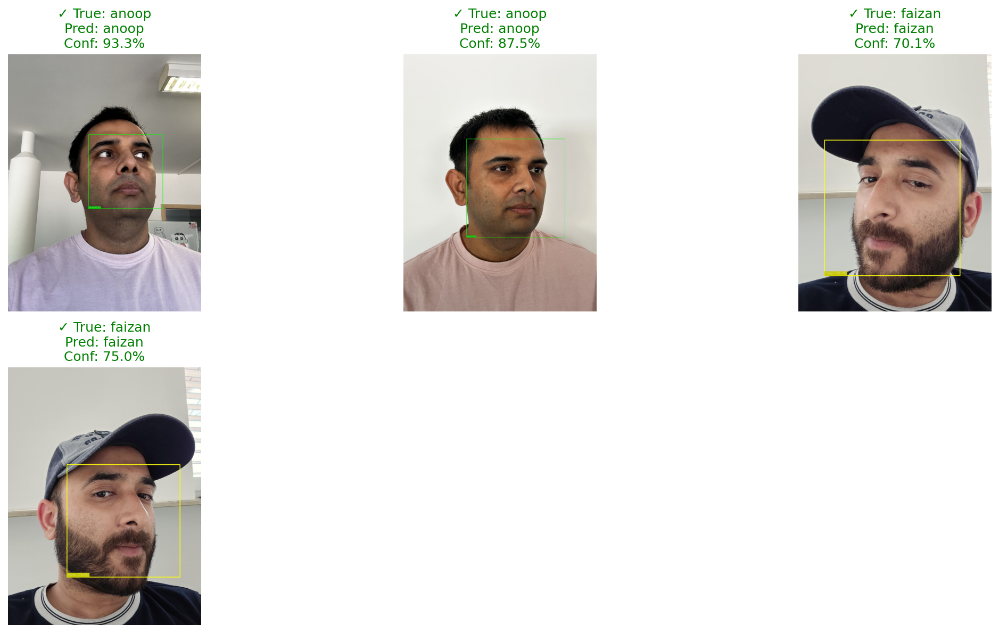

# The Elite Face Recognition System



A high-performance face recognition system with robust unknown face detection capabilities.

## 📊 Performance Metrics

| Metric               | Score    | Description |
|----------------------|----------|-------------|
| **Accuracy**         | 94.74%   | Overall correct predictions |
| **Precision (Macro)**| 92.31%   | Correct known face predictions |
| **Recall (Macro)**   | 94.44%   | True positives identified |
| **F1 Score (Macro)** | 92.62%   | Balance of precision and recall |
| **Average Confidence** | 92.29% | Confidence for known faces |

### Detailed Breakdown:
- **Total Samples**: 57 faces evaluated
- **Known Faces**: 44 predictions (100.00% correct)
- **Unknown Faces**: 13 predictions (76.92% correct)

## 🚀 Features

- High accuracy face recognition (94.7% overall)
- Robust unknown face detection
- Confidence scoring for predictions
- Real-time processing capabilities
- Optimized for both known and unknown faces

## 📦 Installation

1. Clone the repository:
   ```bash
   git clone https://github.com/faizanahmedraza/facial-recognition.git
   cd facial-recognition

2. Install dependencies:
    ```bash
    pip install -r requirements.txt
